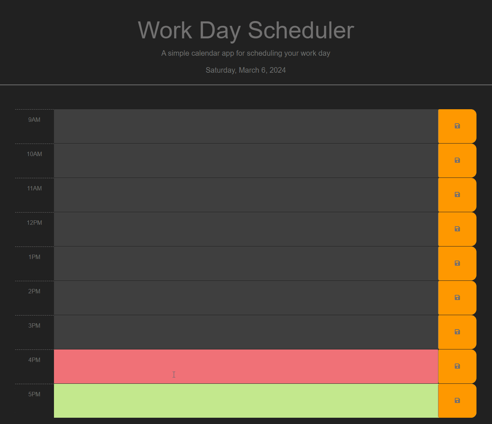

# Work Day Scheduler

## Table of Contents
- [Description](#description)
- [Files](#files)
- [Requirements](#requirements)
- [Installation](#installation)
- [Usage](#usage)
- [Live Site](#live-site)
- [Preview](#preview)

## Description
The Work Day Scheduler is a simple calendar application that allows users to save events for each hour of a typical working day (9am–5pm). Users can add important events to their daily planner to effectively manage their time.

## Files
- `index.html`: HTML file for the Work Day Scheduler.
- `style.css`: CSS file containing styles for the application.
- `script.js`: JavaScript file providing functionality to the application.

## Requirements
Web browser with JavaScript enabled.

## Installation
1. Clone the repository to your local machine:

    ```bash
    git clone https://github.com/jordanchives/work-day-scheduler.git
2. Navigate to the project directory.

## Usage
1. Open `index.html` in a web browser.
2. The current day will be displayed at the top of the calendar.
3. Time blocks for standard business hours (9am–5pm) will be presented.
4. Each time block will be color-coded to indicate whether it is in the past, present, or future.
5. Click into a time block to enter an event.
6. Click the save button for a time block to save the event text in local storage.
7. Saved events will persist even after refreshing the page.

## Live Site
The live site can be accessed [here](https://jordanchives.github.io/work-day-scheduler/).

## Preview
